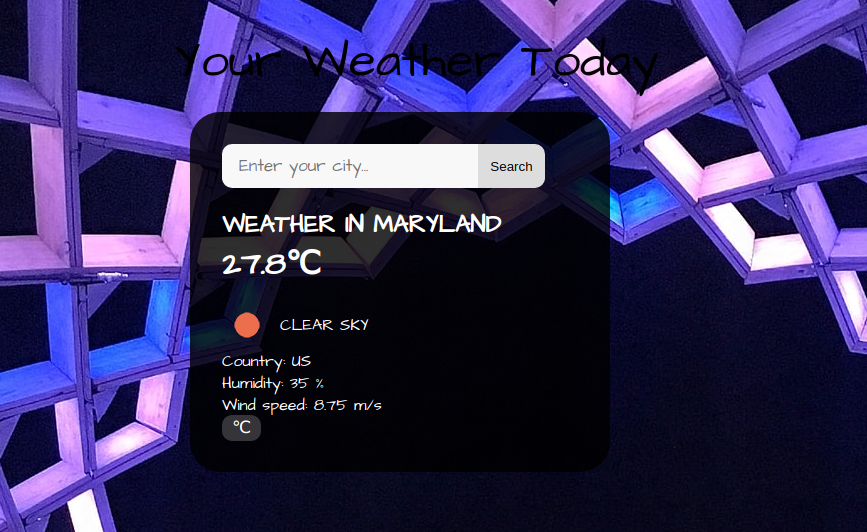

# WEATHER APPLICATION

This project is a simple web app that shows the weather report of a chosen city in any part of the world.
In this app, users can enter the name of a city and see the weather conditions. Users can also switch between metric units (celcius degree) and imperial units (fahrenheit degree) to see the results.

## Built With
- JavaScript
- Webpack
- HTML & CSS

## Setup
- Create a config file to hide your generated API KEYS
- Add the file to your .gitignore file
- The config file should look like this OR use this <a href="https://gist.github.com/derzorngottes/3b57edc1f996dddcab25">Hide API keys</a> 

## Getting Started
To get a copy up and running follow these simple example steps:-

- Clone https://github.com/okikiola11/weather-app.git to your local machine.
- cd into the weather-app directory and navigate into the dist directory.
- Open the index.html file with the browser

## Usage
- Clone the project to your local machine
- Run npm install
- npm run dev

### Live Demo
<a href="https://rawcdn.githack.com/okikiola11/weather-app/334b8d332fa102b77e5d8ac4a42980d33aeafd52/dist/index.html">Click here

## Author
 Okikiola Apelehin

- Github: [@okikiola11](https://github.com/okikiola11)
- Twitter: [@Kikiolla3](https://twitter.com/Kikiolla3)
- Linkedin: [@okikiola-apelehin](https://www.linkedin.com/in/okikiola-apelehin-459008122/)

## 🤝 Contributing

Contributions, issues and feature requests are welcome!

Feel free to check the [issues page](https://github.com/okikiola11/weather-app/issues).

## Show your support

Give a ⭐️ if you like this project!

## Acknowledgments

- <a href="https://google.com">Google</a>
- <a href="https://openweathermap.com">Openweather API </a>
- Images used are taken from <a href="https://unsplash.com">Unsplash.com</a>

## 📝 License

This project is [MIT](lic.url) licensed.